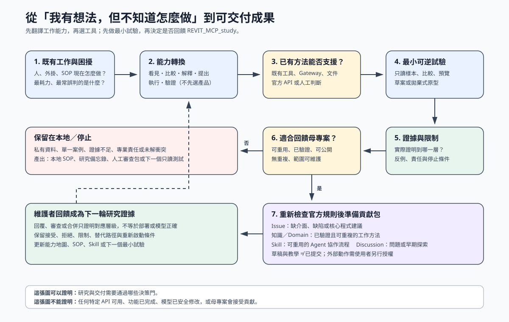

# Revit MCP Research Partner

`revit-mcp-research-partner` 是一個 Codex Skill，用來協助設計與工程使用者，把「我知道工作可以改善，但不知道 AI、工具或方法怎麼選」轉成可測試的實作路徑。它的重點不是自動產生 MCP Tool，而是把既有外掛、人工流程、Domain SOP、Issue / PR 討論、模型證據與失敗紀錄，轉換成能力地圖、最小試驗，以及可審查、可交接、可驗證的下一步。

這個 Skill 適合處理這類問題：

- 「我有一個既有 Revit 工作流程，想整理成 Skill 或 MCP workflow。」
- 「外掛已經能產生候選，但後面都靠人判斷，能不能沉澱成 SOP？」
- 「這個 Issue / PR / 測試紀錄到底證明到哪一層？」
- 「這個工作應該做成外掛、Domain SOP、MCP Tool proposal、GitHub Issue，還是先人工審查？」
- 「使用者自己也說不清楚問題，只知道某個 BIM 工作流程常常卡住。」
- 「我有一個改善想法，但不知道 AI 可以幫我看、比、解釋、執行，還是驗證哪一段。」

它不適合當作一般 Revit 問答、專業簽認工具、結構或法規判斷代理人，也不會把所有需求都推向 MCP Tool 化。

## 這個 Skill 解決什麼問題

許多 BIM 自動化需求一開始不是清楚的「功能需求」，而是來自現場流程：

```text
既有外掛可以做一部分
-> 人靠經驗看結果
-> 某些例外要手動處理
-> 沒有清楚證據知道完成到哪裡
-> 後續很難交接、測試或發 Issue
```

這個 Skill 的工作是先把流程拆清楚，而不是急著寫工具：

```text
理解情境
-> 檢查既有資料與流程
-> 找出候選與判斷點
-> 產生可審查的表格、SOP、Issue draft 或 SVG 脈絡圖
-> 判斷成果應該回到哪一層
-> 定義驗證方法與停止條件
```

它扮演的是「能力翻譯橋梁」：使用者不需要先學會 Agent、API 或 MCP 的名詞，而是先描述現在怎麼做、哪裡卡住、希望變成什麼。Skill 再把需求翻譯成「看見現況、比較差異、解釋原因、提出方案、執行操作、驗證結果」等能力，檢查既有方法已經能做哪些部分，最後只測剩下的缺口。

這個想法類似設計教育中的提醒：不要讓不熟悉建模工具限制設計。差別是，在 AI 時代不必先投入大量時間學完整套工具，才能開始驗證構想；可以先讓 AI 協助查證方法、建立小型試驗、解釋限制，再由使用者逐步學會如何改造自己的工作。這裡的「用 AI 學 AI」不是讓 Agent 代替專業判斷，而是用真實工作與可驗證成果作為學習介面。

最後的結果可能是：

- 保留既有外掛，補一份 Domain SOP。
- 做成 Skill / MCP workflow，讓 Agent 負責蒐集證據、定位例外、問少量關鍵問題。
- 發 GitHub Issue，描述缺少的介面、可重現案例與驗收條件。
- 寫 MCP Tool proposal，但只在規則清楚且確實缺少機器介面時才做。
- 停在人工作業或專業審查，不進入自動執行。

## 方法來源

這個 Skill 不是從單一模板產生，而是整合了幾個方法來源。

### 1. Codex Skill Creator 原則

Skill 本體只放會改變 Codex 決策的指引，不塞通用 BIM 教材，也不把專案演講內容原樣搬進來。長背景、案例與交付格式放在 `references/`，由 `SKILL.md` 按情境載入。

### 2. Decision-tree style questioning

這個 Skill 借用了 `grilling / grill me` 類型 Skill 的精神：不要替使用者偷做決策；先找事實，把未決問題拆成一棵決策樹。

但它不是純追問型 Skill。這裡的追問只能服務於四件事：

- 證據分類
- 既有流程轉換
- 責任與安全邊界
- 成果分流與驗證

每輪都應該盡量產出可審查 artifact，例如候選表、流程轉換表、SOP 草案、Issue draft、驗證矩陣或 SVG 圖，而不是一直問到完全清楚才開始工作。

### 3. Revit / MCP / BIM 證據分層

Skill 會明確區分不同證據層級：

| 層級 | 代表意義 | 不能混用成 |
| --- | --- | --- |
| 想法 | 假設、需求、推測 | 已完成功能 |
| 原始證據 | 文件、Issue、模型觀察、失敗紀錄 | 已驗證規則 |
| 原始碼 | 有實作或設定 | 已部署 |
| 測試通過 | 指定環境與測試通過 | 實機模型可用 |
| 建置產物 | 有產出檔案 | 已被 Revit 載入 |
| 部署 | 已安裝或發布到某處 | 實際模型結果正確 |
| 實機執行 | 指定宿主 / 模型跑過 | 已獨立驗證 |
| 讀回驗證 | 寫入後用獨立方式讀回 | 專業簽認 |
| 專業簽認 | 負責人接受指定範圍 | 可泛用到所有案例 |

### 4. `REVIT_MCP_study` Issue / PR 研究回饋

這個 Skill 是為了回饋與沉澱 [`shuotao/REVIT_MCP_study`](https://github.com/shuotao/REVIT_MCP_study) 的公開研究脈絡而整理。它參考了該專案中的 Issues、Pull Requests、維護者回覆、失敗修正與 SOP 化思路，將其中可重用的邏輯整理成研究協作方法。

目前內建的案例庫不是功能目錄，而是決策模式庫，例如：

- 候選清單不等於可以直接修改。
- Preview 不可靠時必須停止寫入。
- 被拒絕的機制也應保留替代路徑與重啟條件。
- PR、測試、截圖或 API success 不能直接當作實機部署與讀回驗證。
- 文件存在不代表 Skill 或 workflow 真的會使用它。
- 大型 PR 應拆成可獨立審查的成果。
- UI 能做到不代表公開 API 支援。
- 跨系統移植需要重新確認身份、單位、版本與能力邊界。

這個 repo 不是 `REVIT_MCP_study` 的官方組件，也不代表該專案維護者立場。它的用途是把公開互動中值得複用的研究方法整理成 Codex Skill，方便後續把案例轉成 SOP、Issue、proposal 或人工審查包；當成果已驗證、可公開且符合母專案範圍時，再協助準備回饋母專案的貢獻包。

## 安裝方式

將此資料夾放到 Codex skills 目錄：

```text
%USERPROFILE%\.codex\skills\revit-mcp-research-partner
```

重新啟動或刷新 Codex 後，Skill 會依 `SKILL.md` 的 description 被自動選用。也可以在對話中明確要求使用：

```text
使用 revit-mcp-research-partner 幫我整理這個 Revit/MCP 工作流程
```

## 建議搭配：先連上 Revit Gateway

如果研究對象牽涉目前開啟的 Revit 模型，建議先安裝並開啟 [`REVIT_MCP_study`](https://github.com/shuotao/REVIT_MCP_study) 或等效的 Revit Gateway / Agent 連線。這不是硬性前提，但會讓互動效果好很多，因為 Skill 可以建議 Agent 直接讀取：

- 目前開啟的 Revit document
- active view
- selection
- element identity
- category / type / parameter
- 目前模型狀態與讀回結果

這能減少只靠截圖、印象或口頭描述造成的誤判。尤其當使用者自己也說不清楚問題時，live state read 能先把「我覺得怪怪的」轉成可檢查的候選清單。

但 Gateway 連線只代表多了一個證據來源，不代表已授權修改模型。任何模型 mutation 仍然必須先有 preview、rollback / Undo、independent readback 與人工核准。

## 使用方式

你不需要一開始就提出完整規格。可以用很模糊的方式開始：

```text
我有一套既有外掛流程，想整理成 Skill 或 MCP workflow，但不知道怎麼開始。
```

Skill 應該先做：

1. 檢查你提供的外掛文件、SOP、Issue、PR、模型證據或失敗紀錄。
2. 不重複問可以從檔案或 repo 查到的資訊。
3. 若 Revit Gateway / Agent 已連線，優先建議做 read-only live state check。
4. 優先只問一到兩個會改變方向的問題；只有為了避免錯誤或不安全分流時才增加第三個。
5. 先產出可審查的小成果，而不是直接提工具。

典型輸出會包含：

- 研究問題與範圍
- 已知證據與證據層級
- 工程規則、情境判斷、模型副作用與人工責任
- 建議落地方向
- 最小可行成果
- 驗證方法
- 停止條件

若你只有一個模糊想法，也可以直接說：

```text
我覺得這個流程應該可以改善，但不知道 AI 可以怎麼幫，也不知道要做成什麼。
```

第一輪不會丟給你一串產品名稱，而會產出：

| 現在怎麼做 | 想改變什麼 | 需要的能力 | 已有方法 | 尚缺什麼 | 最小試驗 |
| --- | --- | --- | --- | --- | --- |
| 人、外掛或文件目前的流程 | 想減少的耗力、誤判或不確定 | 看見、比較、解釋、提出、執行、驗證 | 現有外掛、SOP、Gateway、官方 API 或人工判斷 | 介面、證據、例外或責任 | 一個只讀樣本、比較表、預覽、草案或拋棄式原型 |

這張表的目的不是替你選最流行的 AI，而是找出「下一個最便宜、可推翻、能真正增加理解的測試」。

## 三種研究深度

Skill 不會讓每個問題都走完整研究流程。它會依未知程度、影響範圍與責任選擇最輕、但仍足以支持決定的深度：

| 深度 | 適用情況 | 第一輪通常得到什麼 |
| --- | --- | --- |
| 快速 | 範圍明確、只讀、身份與來源可靠、不涉及專業決定 | 一次必要檢查、直接結果、證據限制，以及需要時的一個下一步 |
| 標準 | 要把既有外掛、人工習慣、SOP 或失敗紀錄轉成協作流程 | 流程轉換表、主要未知、建議分流，以及最多兩個關鍵問題 |
| 嚴格 | 涉及持久修改、共享或變動狀態、跨版本能力、大範圍影響或責任邊界 | 完整證據表、安全與所有權條件、驗證方式、停止條件和人工決定 |

如果快速檢查發現證據看不到真正影響結論的狀態、資料互相矛盾，或操作影響比預期大，就會升級研究深度。嚴格路徑也可以在移除高風險範圍後，退回處理一個較小的只讀問題。

這項分級的目的不是少做驗證，而是讓簡單問題不必付出完整研究流程的成本，複雜問題仍保留完整邊界。

## 不完整資料也可以開始

Skill 不預設公司已經有整理好的知識庫。面對口述習慣、零散文件、既有操作、模型觀察或互相矛盾的說法，會先分成：

- 原始紀錄
- 可查證事實
- 尚未確認的推論
- 互相矛盾的規則
- 需要負責人決定的事項

只有經過查證且範圍清楚的內容才會被提升成可重複規則。RAG 或索引可以在資料量變大時提供協助，但不是開始研究的前提。

## Prompt 要求不等於程式保證

Skill 會分開標示四個層級：

```text
流程要求
!= 工具介面承諾
!= 程式實際防護
!= 指定執行批次的觀察結果
```

例如，Skill 要求 rollback，不代表執行端已經實作可靠的 rollback。若模型修改需要失敗隔離、恢復或共享狀態控制，必須取得對應的工具契約、程式實作與實機驗證；否則只停在 preview、proposal 或人工審查。

## 互動範例：既有流程轉換

使用者：

```text
我現在有一個 Revit 工作流程，平常是先用既有外掛跑一份清單，再靠人看結果，有些情況要手動修。我想把它整理成 Skill 或 MCP workflow，但我不知道怎麼開始。
```

Skill 應回應的方向：

```text
先不假設要做成 MCP Tool。
我要先判斷這個流程裡哪些是固定規則，哪些其實是人的判斷。

這輪只需要確認兩件事：
1. 這個流程目前最常從哪裡開始：外掛按鈕、表格、模型視圖，還是檢查報告？
2. 最常卡住的是找不到對象、判斷不一致、修改會影響模型，還是完成證據不足？
```

接著應產出流程轉換表：

| 流程段落 | 現在誰做 | 建議轉換 | 先不要做 |
| --- | --- | --- | --- |
| 外掛產生候選 | 既有外掛 | 保留為穩定前處理 | 不重寫外掛 |
| 人看候選 | 有經驗的人 | Skill 引導判斷、整理例外 | 不假裝 Agent 取代判斷 |
| 決定是否處理 | 人 | Review packet / SOP 判斷狀態 | 不直接寫入模型 |
| 後續修正 | 人或外掛 | 之後再評估 plugin / MCP Tool | 未有 preview / readback 前不執行 |

建議分流：

| 成果 | 放到哪裡 | 原因 |
| --- | --- | --- |
| 候選來源與欄位定義 | Domain SOP | 人可以照著重複檢查 |
| 例外整理與追問流程 | Skill / MCP workflow | Agent 適合協助蒐證與定位不確定性 |
| 缺少讀取候選清單的介面 | GitHub Issue 或 MCP Tool proposal | 規則清楚但缺機器介面 |
| 會修改模型的步驟 | 人工審查後另案處理 | 需要 preview、rollback、readback、人工核准 |

## 互動範例：Issue / PR 證據審查

使用者：

```text
這個 PR 測試都過了，可以說功能完成了嗎？
```

Skill 應回應的方向：

```text
測試通過只代表它通過那組測試，不等於已部署、已在 Revit 跑過、或已在指定模型讀回驗證。
我會把目前證據拆成：程式碼、測試、建置、部署、實機執行、讀回驗證、專業確認。
```

輸出範例：

| Claim | Current evidence | Status | Next check |
| --- | --- | --- | --- |
| 程式碼存在 | 指定 PR revision | confirmed | 檢查 handler / call path |
| 測試通過 | CI 或本機測試紀錄 | test-level only | 不宣稱部署 |
| Revit 實機可用 | 無指定模型與讀回紀錄 | not proven | 需要授權 dry run 與獨立 readback |

## 互動範例：API 能力研究

使用者：

```text
Revit 畫面上可以做這個設定，那 API 應該也可以吧？
```

Skill 應回應的方向：

```text
不能用畫面能力推測 API 能力。
需要先確認 Revit 版本與官方 Revit API 文件，再判斷是否有公開、支援、可測試的介面。
```

若官方資料未確認，狀態應標為：

```text
officially_unverified
```

並停止在研究或 Issue proposal，不應直接進入實作。

## 從工作構想到母專案回饋

Skill 的原始目的仍然包含回饋 [`REVIT_MCP_study`](https://github.com/shuotao/REVIT_MCP_study)，但不是每個成果都適合提交。它會先完成本地研究，再檢查四件事：

1. 結果是否不只適用單一私有模型或公司習慣。
2. 驗證證據是否足以支撐要提出的範圍。
3. 是否能安全公開，且沒有客戶、公司、模型、憑證或授權受限資料。
4. 是否已搜尋母專案現有 Domain 文件、Skills、Issues、Pull Requests 與 Discussions，確認不是重複工作。



這張圖是交付與決策脈絡，不是任何 API、功能完成、模型安全或母專案接受的證明。

### 如何判斷要走哪一條路

| 研究成果 | 可能的回饋方式 | 送出前至少要有 |
| --- | --- | --- |
| 已驗證、可重複的人工作法 | 目前貢獻指南允許的知識 / Domain 路徑 | 觸發條件、步驟、例外、驗證、適用限制 |
| 可重用的 Agent 協作方法 | Skill 貢獻候選 | 獨立觸發、輸出契約、停止條件、情境測試、既有工具相容性 |
| 明確缺少介面、發現缺陷或建議核心程式變更 | Issue-first，除非當前規則或維護者明確允許其他方式 | repo / 版本、案例或重現、證據、預期結果、驗收條件、排除項目 |
| 問題、展示或早期想法 | 母專案目前指定的 Discussion 或社群路徑 | 已嘗試內容、目前證據、希望維護者回答的決定 |
| 私有、單一案例、仍有爭議或證據不足 | 不上游，留在本地研究 / SOP / 人工審查 | 清楚的停止原因與重新評估條件 |

截至 **2026-08-27** 查閱的 [`CONTRIBUTING.md`](https://github.com/shuotao/REVIT_MCP_study/blob/main/CONTRIBUTING.md) 顯示，外部貢獻者的可驗證工作流程可走知識 / `domain/` 路徑，外部 fork 對核心程式的建議原則上先發 Issue；README 也把問題與展示導向 Discussions。這只是本次檢查快照，不是永久規則。Skill 每次準備貢獻都必須重新讀取最新 README、`CONTRIBUTING.md`、模板、repository instructions 與相關討論；若維護者對特定案例給了明確例外，則保留該連結並只在授權範圍內遵循。

### Skill 會怎麼教你準備提交

Skill 會產出一份 upstream contribution pack：

- 為何適合母專案，以及目前證據只證明到哪裡。
- 剛查閱的官方規則、日期或 revision。
- 相關 Domain / Skill / Issue / PR / Discussion 與重複性判斷。
- 建議路徑、標題、本文、檔案範圍、驗收條件、限制與維護者問題。
- 已移除私有資訊的證據與重現步驟。
- GitHub 網頁操作步驟，以及情境適合時的 Git / `gh` 操作建議。

網頁提交的基本流程是：先搜尋 open / closed 紀錄，選擇當前模板或分類，貼入經審查的草稿，檢查連結與敏感資訊，最後停在提交按鈕前。若是 fork 貢獻，則先確認外部貢獻者可修改的路徑，再建立單一目的分支、執行官方要求的驗證、檢查 diff 與敏感資訊，最後準備 PR 草稿。

研究、草稿與教學不等於外部提交授權。建立 Issue、留言、push 或開 Pull Request 前，仍需使用者另外明確同意。完整規則在 [`references/revit-mcp-study-contribution.md`](references/revit-mcp-study-contribution.md)。

## 產出物

Skill 會依情境產出不同 artifact：

| 需求 | 主要產出 |
| --- | --- |
| 不知道下一步 | Action register |
| 想重複交接流程 | Domain SOP draft |
| 判斷是否需要機器介面 | MCP Tool proposal |
| 準備回報 repo | GitHub Issue draft |
| 需要人決定 | Review packet |
| 關係與流程複雜 | SVG context / workflow diagram |
| 多個假設要驗證 | Validation matrix |
| 有改善想法但不知道怎麼實現 | Capability conversion map |
| 準備回饋母專案 | Upstream contribution pack |

內建 SVG assets：

- `assets/research-routing-map.svg`
- `assets/research-navigation-map.svg`
- `assets/issue-pr-evidence-workflow.svg`
- `assets/idea-to-upstream-feedback-loop.svg`

這些圖是審查表面，不是工程證據本身。

## 專案結構

```text
SKILL.md
agents/
  openai.yaml
references/
  research-output-contract.md
  revit-mcp-boundaries.md
  routing-targets.md
  practical-deliverables.md
  case-based-work-modes.md
  case-evidence-patterns.md
  research-navigation.md
  research-case-library.md
  response-examples.md
  revit-mcp-study-contribution.md
assets/
  research-routing-map.svg
  research-navigation-map.svg
  issue-pr-evidence-workflow.svg
  idea-to-upstream-feedback-loop.svg
```

## 邊界與限制

- 不替代工程判斷、結構簽認、法規責任或模型修改責任。
- 不預設所有工作都應 MCP Tool 化。
- 不宣稱 Agent 比熟練 Revit 使用者更快，除非有可比 benchmark。
- 不把 Issue 回覆、commit、測試通過、截圖或 API success 當成讀回驗證或正式部署。
- 未取得明確同意，不修改 SC REVIT、Revit MCP、BIM Agent、公司內部資料或 live model。
- 涉及模型 mutation 時，必須先有 preview、rollback / Undo、independent readback 與人工核准。
- Revit Gateway / Agent 連線是讀取現況與驗證的輔助，不是修改模型的授權。
- 涉及專業軟體 API 功能研究或實作時，必須查官方資料，不以 Agent 記憶或推測作為依據。

## 目前狀態

這是研究協作優化版。它已包含：

- Skill entrypoint
- Codex metadata
- 10 份 reference
- 4 份 SVG workflow assets
- 從 `REVIT_MCP_study` 公開 Issues / PRs 萃取的案例邏輯
- 快速、標準、嚴格三種研究深度
- 不完整資料整理與證據充分性判斷
- 流程要求、工具契約、程式防護與實機結果的保證層級
- 共享或變動狀態下的停止與重新審查條件
- 從模糊工作構想到能力地圖、最小試驗與可用成果的轉換流程
- 依母專案最新規則重新查證的 upstream contribution pack 與送出前教學

已做基本結構檢查與安全掃描。`quick_validate.py` 需要本機 Python 環境有 `PyYAML`；若環境缺少 PyYAML，需使用手動 frontmatter、reference link、placeholder、mojibake 與敏感字串掃描替代。

## License

No license has been selected for this repository yet. Do not assume reuse rights beyond the repository owner's stated terms.
